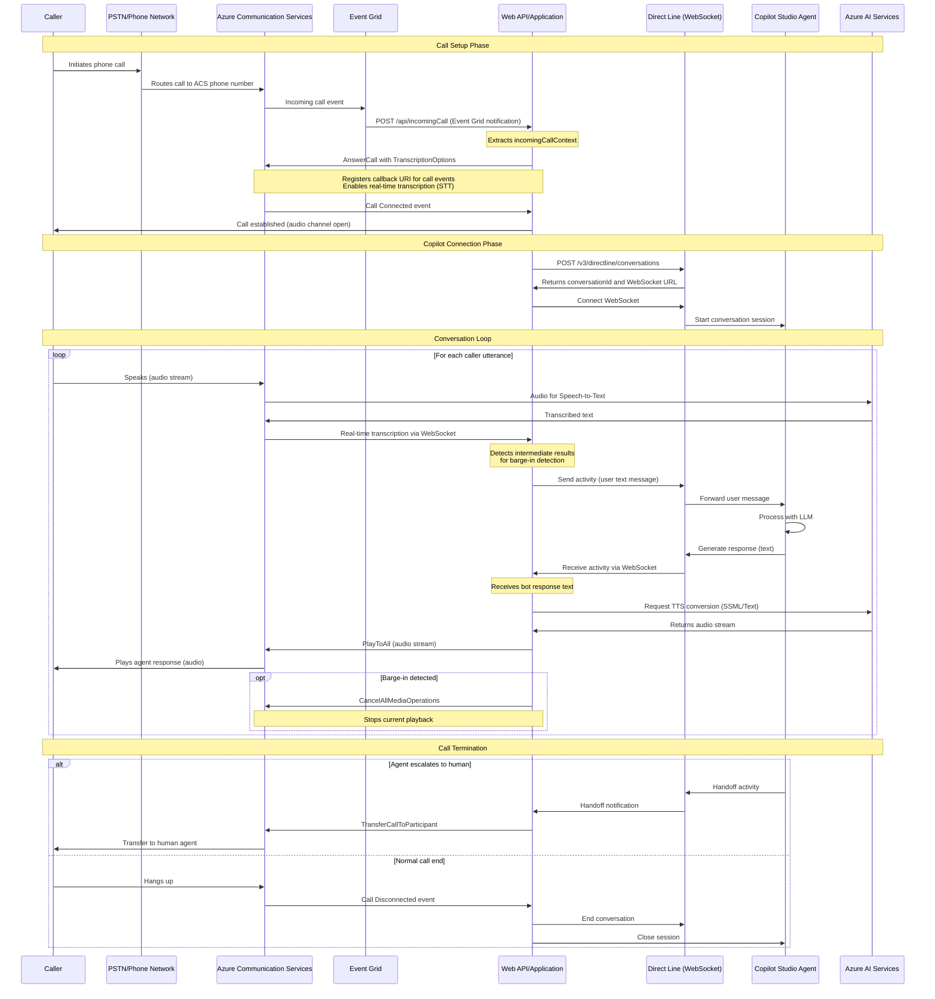

# Azure Communication Services + Copilot Studio Integration

## Overview

This document outlines the low-code approach to integrate Azure Communication Services (ACS) with Microsoft Copilot Studio to create voice-enabled AI agents that users can call into.

## Architecture Components

### Required Services
1. **Azure Communication Services (ACS)** - Handles phone calls and provides telephony capabilities
2. **Microsoft Copilot Studio** - Provides the AI agent with conversational logic
3. **Azure AI Services** - Provides Speech-to-Text and Text-to-Speech capabilities
4. **Event Grid** - Delivers incoming call notifications
5. **Web API/Application** - Orchestrates the integration between services
6. **Direct Line API** - Microsoft's channel protocol for bot communication

## How It Works

### Key Clarifications

Your understanding was mostly correct, but here are some important clarifications:

1. **Direct Line Channel** does NOT convert text to audio. Instead:
   - Your API receives transcribed text from ACS real-time transcription
   - Your API sends text to Copilot Studio via Direct Line WebSocket
   - Copilot Studio returns text responses
   - Your API uses **ACS Play API with Azure AI Services** to convert text to speech (TTS)

2. **Event Grid** is used for the initial incoming call notification, not for ongoing audio streaming

3. **Real-time Transcription** is handled by ACS with Azure AI Services integration (Speech-to-Text), not by Direct Line

4. **WebSocket connections** are used in two places:
   - Between your API and ACS for receiving real-time transcription
   - Between your API and Copilot Studio (Direct Line) for bidirectional messaging

## Sequence Diagram



## Detailed Flow Breakdown

### 1. Call Setup Phase

**Event Grid → Incoming Call Notification**
- When a caller dials your ACS phone number, Event Grid sends an `IncomingCall` event to your registered webhook endpoint
- Your API receives the `incomingCallContext` from the event payload

**Answer Call with Transcription**
- API calls `AnswerCallAsync()` with:
  - `TranscriptionOptions` - enables real-time STT via WebSocket
  - `CallIntelligenceOptions` - configures Azure AI Services endpoint
  - `CallbackUri` - registers webhook for call events
- ACS establishes the call and opens an audio channel with the caller

### 2. Copilot Connection Phase

**Direct Line Setup**
- API initiates a conversation with Copilot Studio using Direct Line REST API
- Receives a `conversationId` and WebSocket stream URL
- Opens WebSocket connection for bidirectional messaging with the agent

### 3. Conversation Loop

**Speech-to-Text (Caller → API)**
- Caller speaks into the phone
- ACS streams audio to Azure AI Services for real-time transcription
- Transcribed text is sent to your API via WebSocket
- API can detect intermediate results for barge-in scenarios

**Agent Processing (API → Copilot Studio)**
- API sends transcribed text as a "user activity" via Direct Line WebSocket
- Copilot Studio processes the message with its underlying LLM
- Agent generates a text response based on configured topics and knowledge

**Text-to-Speech (API → Caller)**
- API receives text response from Copilot Studio
- API creates SSML (Speech Synthesis Markup Language) from the text
- API calls ACS `PlayToAllAsync()` with SSML source
- ACS uses Azure AI Services TTS to convert text to audio
- Audio is played to the caller over the phone line

**Barge-in Handling**
- When caller starts speaking during agent playback (detected via intermediate transcription results)
- API calls `CancelAllMediaOperationsAsync()` to stop the current audio playback
- New user input is processed immediately

### 4. Call Termination

**Agent Escalation**
- If agent detects need for human assistance, it sends a "handoff" activity
- API receives handoff notification via Direct Line
- API uses `TransferCallToParticipantAsync()` to transfer call to human agent

**Normal End**
- Caller hangs up or agent ends conversation
- ACS sends `CallDisconnected` event to API
- API closes Direct Line WebSocket and ends Copilot session

## Prerequisites

### Azure Resources
- Azure Communication Services resource with phone number
- Azure AI Services (multiservice resource with custom domain)
- Microsoft Copilot Studio license

### Copilot Studio Configuration
1. Create and configure agent in Copilot Studio
2. Disable authentication (Security → Authentication → No Authentication)
3. Get Web Channel Security key (Security → Web Channel Security)
4. Publish the agent

### Application Requirements
- Web service using Call Automation SDK
- Public endpoint (e.g., using dev tunnels) to receive Event Grid notifications
- WebSocket support for:
  - Real-time transcription from ACS
  - Direct Line communication with Copilot Studio

## Configuration Parameters

```json
{
  "ACS": {
    "ConnectionString": "your-acs-connection-string",
    "PhoneNumber": "+1234567890"
  },
  "CopilotStudio": {
    "DirectLineSecret": "your-web-channel-security-key"
  },
  "AzureAI": {
    "CognitiveServicesEndpoint": "https://your-custom-domain.cognitiveservices.azure.com"
  },
  "Application": {
    "BaseUri": "https://your-api-domain.com",
    "WebSocketUri": "wss://your-api-domain.com"
  }
}
```

## Key APIs Used

### ACS Call Automation
- `AnswerCallAsync()` - Answer incoming call with transcription enabled
- `PlayToAllAsync()` - Play audio (TTS) to all participants
- `CancelAllMediaOperationsAsync()` - Cancel current playback (barge-in)
- `TransferCallToParticipantAsync()` - Transfer to human agent

### Direct Line API
- `POST /v3/directline/conversations` - Start new conversation
- WebSocket streaming - Bidirectional messaging with agent

### Azure AI Services
- Real-time Speech-to-Text (via ACS integration)
- Text-to-Speech via SSML (via ACS Play API)

## Important Notes

1. **No Audio Buffering to Direct Line**: Direct Line doesn't handle audio. All audio processing (STT/TTS) is done through ACS with Azure AI Services.

2. **WebSocket for Transcription**: Real-time transcription is delivered via WebSocket from ACS to your API, not through Direct Line.

3. **SSML for Voice Optimization**: Use SSML (Speech Synthesis Markup Language) for better voice quality and control over pronunciation, pacing, and emphasis.

4. **Barge-in Detection**: Intermediate transcription results enable natural conversation flow by detecting when the caller interrupts the agent.

5. **Event Grid for Notifications Only**: Event Grid is used for initial call notifications, not for ongoing audio/data streaming.

## Best Practices

### Voice Optimization
- Configure Copilot Studio topics to use "speech-optimized" message types
- Keep agent responses concise for better voice experience
- Use SSML to add natural pauses and emphasis

### System Topics
- Review and configure built-in system topics
- Implement custom logic for handoff scenarios
- Consider disabling unnecessary system topics

### Error Handling
- Implement retry logic for Azure AI Services calls
- Handle WebSocket disconnections gracefully
- Log all call events for troubleshooting

### Performance
- Use asynchronous operations throughout
- Minimize latency in text processing pipeline
- Monitor transcription accuracy and adjust language models as needed

## Sample Code Structure

```
├── Program.cs
│   ├── /api/incomingCall (Event Grid endpoint)
│   ├── /api/calls/{callId} (Callback URI for call events)
│   └── /ws (WebSocket endpoint for transcription)
├── Services/
│   ├── DirectLineService.cs (Copilot Studio integration)
│   ├── CallAutomationService.cs (ACS operations)
│   └── TranscriptionHandler.cs (Real-time STT processing)
└── Models/
    ├── CallContext.cs
    └── ConversationState.cs
```

## References

- [Microsoft Learn Article](https://learn.microsoft.com/en-us/azure/communication-services/samples/integrate-azure-communication-services-with-copilot-studio)
- [Sample Code on GitHub](https://github.com/Azure-Samples/communication-services-dotnet-quickstarts/tree/main/CallAutomation_MCS_Sample)
- [Copilot Studio Quickstart](https://learn.microsoft.com/en-us/microsoft-copilot-studio/fundamentals-get-started)
- [ACS Call Automation SDK](https://learn.microsoft.com/en-us/azure/communication-services/concepts/call-automation/call-automation)

## Summary

This low-code approach enables voice-enabled AI agents by:
1. Using Event Grid to capture incoming calls
2. Leveraging ACS Call Automation with real-time transcription (STT)
3. Connecting to Copilot Studio via Direct Line WebSocket for conversational logic
4. Using ACS Play API with Azure AI Services for text-to-speech (TTS)
5. Supporting natural conversation flow with barge-in detection
6. Enabling escalation to human agents when needed

The architecture keeps audio processing within ACS/Azure AI Services while using Direct Line purely for text-based agent communication, creating a seamless voice experience for callers.
