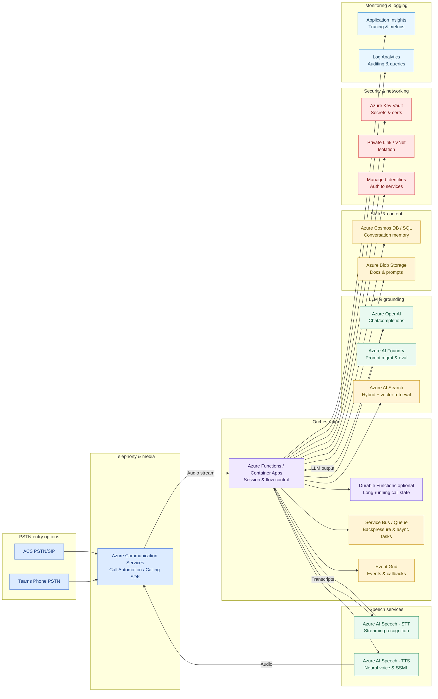
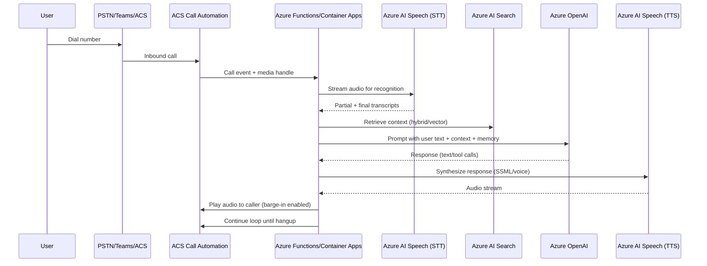

# Azure Voice Chatbot Architecture

## Overview

This document describes a production-ready architecture for a phone-in chatbot that enables users to speak, get transcribed, converse with an LLM, and hear responses back. The solution leverages Microsoft Azure services to deliver a scalable, secure, and compliant voice interaction system.

The architecture supports multiple PSTN entry points (Microsoft Teams Phone or Azure Communication Services) and cleanly separates concerns across telephony, orchestration, AI processing, and data management layers.

---

## Architecture Components

### Entry Points

The architecture supports two PSTN entry patterns:

#### Teams Phone Integration
- **Flow**: `PSTN Call → Teams Phone → Teams Call Queue/Auto Attendant → Transfer to ACS endpoint → ACS Call Automation → Your App`
- **Use when**: You have existing Teams Phone infrastructure or need human handoff capabilities
- **Setup**: Configure Teams Call Queue or Auto Attendant to transfer calls to an ACS resource endpoint
- **Benefits**: Leverage existing Teams investment, enable hybrid human/bot scenarios

#### ACS Direct Entry
- **Flow**: `PSTN Call → ACS PSTN/SIP → ACS Call Automation → Your App`
- **Use when**: You want a standalone bot phone number with full programmatic control
- **Setup**: Acquire phone number directly from ACS, configure direct routing
- **Benefits**: Simpler architecture, no Teams dependency, full control over call flow

### Telephony & Media Layer
- **Azure Communication Services Calling SDK**: Provides call control, media streaming, and audio playback capabilities

### Orchestration Layer
- **Azure Functions / Azure Container Apps**: Manages session state, request routing, and error handling
- **Durable Functions**: Handles long-running call flows and state management (optional)
- **Service Bus / Queue Storage**: Manages backpressure and asynchronous task processing
- **Event Grid**: Handles async events and callbacks

### Speech Services
- **Azure AI Speech (STT)**: Streaming speech-to-text recognition with custom phrase lists and endpointing
- **Azure AI Speech (TTS)**: Neural text-to-speech synthesis with SSML support and custom voice options

### LLM & Grounding Layer
- **Azure OpenAI**: Chat completions and conversational AI processing
- **Azure AI Foundry**: Prompt management and evaluation
- **Azure AI Search**: Hybrid search (keyword + vector) for context retrieval and grounding

### Data & State Management
- **Azure Cosmos DB / Azure SQL**: Stores conversation memory and session state
- **Azure Blob Storage**: Manages documents, prompts, and content

### Security & Compliance
- **Azure Key Vault**: Secure storage for secrets, keys, and certificates
- **Managed Identities**: Passwordless authentication to Azure services
- **Private Link / VNet**: Network isolation and secure connectivity

### Observability & Monitoring
- **Application Insights**: Distributed tracing, performance metrics, and telemetry
- **Log Analytics**: Auditing, queries, and call analytics

---

## Call Flow

### 1. Inbound Call Setup
- User dials PSTN number
- Entry occurs via Teams Phone (Direct Routing/Operator Connect) or ACS PSTN/SIP
- ACS Call Automation answers the call and attaches the media stream to the orchestrator

### 2. Streaming Recognition
- Audio stream is sent to Azure AI Speech for speech-to-text processing
- Low-latency streaming recognition with custom phrase lists and endpointing
- Orchestrator buffers utterances, detects end-of-turn, and applies barge-in controls

### 3. LLM Reasoning
- Orchestrator constructs a grounded prompt using:
  - Retrieved context from Azure AI Search
  - Session memory from Cosmos DB
  - User utterance transcription
- Azure OpenAI processes the prompt and returns response (text or function/tool calls)
- Optional safety and policy filters are applied

### 4. Response Synthesis
- Azure AI Speech synthesizes the response using Neural TTS
- Optional SSML for prosody, speed adjustments, and barge-in readiness
- ACS plays audio back to caller with support for interruption and turn-taking

### 5. Telemetry & Compliance
- Application Insights correlates:
  - Call ID and session tracking
  - Utterance timing and turn-taking metrics
  - LLM latency and token usage
  - ASR/TTS quality metrics
  - User satisfaction signals
- Security measures include:
  - Keys stored in Key Vault
  - PII redaction where required
  - Storage access via private endpoints

---

## Architecture Diagram

---

## Call Sequence Diagram

---

## Design Considerations

### Barge-In & Turn-Taking
- Leverage ACS media events combined with Speech endpointing
- Keep TTS chunks short to enable quick interruption
- Implement turn-taking logic to handle natural conversation flow

### Latency Targets
- **ASR Partials**: <300–500 ms for streaming recognition results
- **Full-Turn LLM Responses**: <1.5–2 seconds end-to-end
- **Optimization strategies**:
  - Cache frequently requested answers
  - Pre-warm TTS for common responses
  - Use streaming where possible

### Grounding & Retrieval
- Implement hybrid search using BM25 + vector search in Azure AI Search
- Maintain per-call conversation memory in Cosmos DB
- Use semantic ranking for improved context relevance

### Voice Quality
- Use custom Neural TTS or SSML features:
  - Breaks for natural pauses
  - Emphasis for important words
  - Phonemes for proper name pronunciation
- Normalize output length to prevent overly long responses

### Scalability
- Design stateless orchestrator with external session store
- Enable autoscaling on Azure Container Apps based on:
  - Concurrent calls
  - CPU utilization
  - Queue depth
- Use Service Bus or Queue Storage for burst handling

### Compliance & Security
- Enable call recording with appropriate governance
- Implement PII masking in transcripts
- Apply RBAC across all Azure resources
- Enable audit logging via Log Analytics
- Use Private Link for network isolation

---

## Implementation Guidelines

### SDKs & Integration
- **ACS Call Automation SDK**: Server-side call control and media handling
- **Speech SDK**: Streaming STT/TTS integration
- **Azure OpenAI REST/SDK**: Chat completions and function calling

### Model Selection
- **Recommended models**:
  - GPT-4o-mini for lower latency
  - GPT-4.1 for higher quality responses
- Use response length controls to manage latency
- Leverage tool-calling for structured interactions

### Prompting Strategy
- Define clear system and safety layers
- Include conversation memory keys in context
- Instrument prompts with:
  - Token usage tracking
  - Latency monitoring
  - Quality metrics

### Testing & Validation
- Shadow user calls in development environment
- Collect key metrics:
  - ASR Word Error Rate (WER)
  - TTS Mean Opinion Score (MOS) proxies
  - End-to-end latency measurements
- Run red-team tests for content safety and adversarial inputs

### Deployment Strategy
- Use blue/green deployments on Container Apps
- Implement throttling via Service Bus
- Configure autoscaling based on:
  - Concurrent call count
  - CPU and memory utilization
  - Queue depth
- Monitor deployment health with Application Insights

---

## Performance Targets

| Metric | Target | Notes |
|--------|--------|-------|
| ASR Partial Results | <300-500ms | Streaming recognition latency |
| End-to-End Response | <1.5-2s | From user utterance to audio playback |
| TTS Synthesis | <500ms | For typical response length |
| Concurrent Calls | 100+ | With appropriate scaling |
| Availability | 99.9% | With multi-region failover |

---

## Security Requirements

- All secrets and certificates stored in Azure Key Vault
- Managed Identities for service-to-service authentication
- Private Link connections for network isolation
- PII detection and redaction in transcripts and logs
- RBAC configured across all Azure resources
- Audit logging enabled via Log Analytics
- Encryption at rest and in transit for all data

---

## Monitoring & Observability

### Key Metrics
- Call volume and duration
- ASR accuracy and latency
- LLM token usage and response time
- TTS quality and synthesis time
- Error rates and types
- User satisfaction signals

### Telemetry Correlation
- Unique call ID tracking across all services
- Distributed tracing with Application Insights
- Custom events for business metrics
- Performance counters for resource utilization

### Alerting
- Service health and availability
- Latency threshold violations
- Error rate increases
- Capacity and scaling triggers

---

## Future Considerations

### Entry Path Selection Guide

| Factor | Teams Phone Entry | ACS Direct Entry |
|--------|------------------|------------------|
| **Existing Infrastructure** | Leverage existing Teams Phone setup | Requires new ACS setup |
| **Human Handoff** | Easy transfer to Teams users | Requires custom implementation |
| **Complexity** | Higher (Teams + ACS integration) | Lower (ACS only) |
| **Control** | Limited by Teams capabilities | Full programmatic control |
| **Cost** | Teams Phone + ACS costs | ACS costs only |
| **Use Case** | Hybrid human/bot scenarios | Dedicated bot line |

#### Teams Phone Integration Details
When using Teams as the entry point:
1. Acquire Teams Phone number via Direct Routing or Operator Connect
2. Configure Teams Call Queue or Auto Attendant
3. Set up call transfer/forwarding to ACS resource endpoint
4. ACS Call Automation receives the transferred call and begins bot interaction
5. Optional: Transfer back to Teams user if human assistance needed

#### ACS Direct Integration Details
When using ACS direct entry:
1. Acquire phone number from ACS
2. Configure webhook endpoints for call events
3. ACS Call Automation answers calls directly
4. No Teams components involved in call flow

### Compliance Requirements
Additional compliance features can be added based on requirements:
- Call recording retention policies
- Geographic data residency
- Industry-specific certifications (HIPAA, PCI-DSS, etc.)
- Advanced PII handling and anonymization

### Carrier Setup
Network isolation and carrier integration details can be tailored based on:
- Chosen entry path (Teams vs. ACS)
- Geographic presence requirements
- Redundancy and failover needs
- SIP trunk configuration
