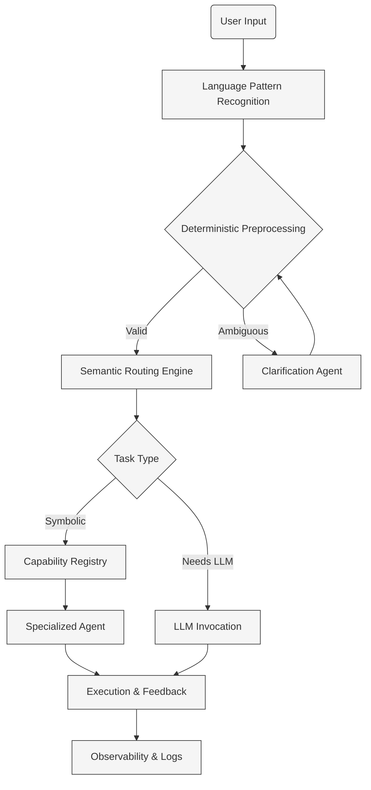

# Software Engineering Principles in Today's Agent-based Landscape ➜ Determinism depends on it!

## Acronyms
| Acronym | Definition |
| --- | --- |
| BNF | Backus-Naur Form; a notation for specifying the grammar of context-free languages. |
| ϵ-NFA | Epsilon-NFA; a non-deterministic finite automaton that permits transitions consuming no input symbols. |
| AST | Abstract syntax tree; a hierarchical representation of the syntactic structure of parsed input. |
| CLI | Command-line interface; a text-based shell for executing developer tooling. |
| DSL | Domain-specific language; a tailored programming language for a focused class of problems. |
| LLM | Large language model; a generative model trained on extensive text corpora to produce natural language outputs. |
| NFA | Non-deterministic finite automaton; an automaton model used to recognize regular languages. |
| OSS | Open-source software; software distributed with source code under permissive licenses. |
| PROSE | Program Synthesis using Examples; Microsoft's synthesis SDK for deriving programs from input-output exemplars. |
| SDK | Software development kit; a packaged set of libraries and tools for building solutions on a platform. |

## Postulates
- BNF supplies the structural blueprint for context-free languages that let us model complex agent conversations without ambiguity.
- Classical regular expressions describe regular languages; every regex can map into BNF by the automata pipeline regex → ϵ-NFA → NFA → regular grammar.
- Agentic solutions need both the grammatical backbone of BNF and the contextual constraints layered afterward so agents reason safely.
- Deterministic agent behavior depends on sharply bounded scopes that limit what each agent may infer or execute.
- Because subtle lexical shifts can redirect an LLM's plan, intent decomposition anchored in classical parsing keeps prompts aligned with the target outcome.
- Supplying disciplined, consistent context alongside each prompt reinforces determinism, making traditional software engineering rigor indispensable to agent workflows.

## 1. Why BNF Matters for Agentic Solutions 🧠
- Guarantees parseable plans: agents can validate outputs before execution.
- Separates syntax (structure) from semantics (meaning), making policy and safety reviews easier.
- Enables tooling: grammar-driven parsers, formatters, and debuggers for agent workflows.
- Supports evolution: extend productions without breaking existing integrations.

## 2. BNF Essentials 🧩
### Core Notation
| Symbol | Meaning |
| --- | --- |
| `<name>` | Non-terminal: replaceable token (mandatory).
| `::=` | "Is defined as"; the production operator.
| `|` | Alternatives; choose one branch.
| `'literal'` | Terminal symbol; appears exactly as written.
| `[]` | Optional sequence (may appear 0 or 1 time).
| `{}` | Repetition (0 or more times) in common extended BNFs.

### Simple BNF Example
```
<command> ::= <action> <target> [<modifier>]
<action> ::= 'open' | 'close'
<target> ::= 'door' | 'window'
<modifier> ::= 'quickly' | 'carefully'
```
- `<action>` and `<target>` are mandatory due to the angle brackets.
- `[<modifier>]` is optional; the user may omit it.
- Nested replacements continue until only quoted terminals remain.

### Parsing Walkthrough
1. Start with `<command>`.
2. Replace with `<action> <target> [<modifier>]`.
3. Pick `'open'` for `<action>`, `'door'` for `<target>`, and drop the optional modifier.
4. Final string becomes `open door`.

## 3. Converting BNF Fragments to Regular Expressions 🔁
Follow the accepted automata sequence for any regular slice:
1. **Identify** the BNF productions that describe a regular language (no nested recursion on multiple non-terminals). Example: `<token> ::= 'A' | 'B' { 'A' | 'B' }`.
2. **Convert to a regular grammar** by ensuring every production conforms to one non-terminal leading to at most one non-terminal on the right-hand side.
3. **Map the regular grammar to an ϵ-NFA** (explicitly capture start, accept states, and optional ε-transitions).
4. **Eliminate ε-transitions** to obtain an NFA.
5. **Transform the NFA into a regex** using state elimination.

Example outcome for the fragment above:
- Regular grammar: `S → 'A'S | 'B'S | ε`.
- Regex after automata conversion: `(A|B)*`.
- The regex now enforces the lexical shell, while the original BNF preserves the richer structure for other productions.

Within Visual Studio Code, the Microsoft.Automata NuGet package (`Microsoft.Research.Automata`) keeps this conversion pipeline grounded in the Microsoft stack. Feed your grammar-derived abstract syntax tree into its automata builders to formalize NFAs, simplify them, and emit `System.Text.RegularExpressions` patterns without leaving the .NET toolchain.

## 4. Elevating BNF to Agentic Context 🤖
1. **Annotate semantics**: link non-terminals to intent classes (`<action>` ➜ "control" intent).
2. **Bind context**: attach constraints (e.g., `<target>` only accepts resources the user can access).
3. **Implement adapters**: translate parse trees into planner inputs or tool invocations.
4. **Enforce validation layers**: use the regex derivative for fast rejection, then full BNF parsing, then contextual policy checks.
5. **Feed back learning**: log agent interactions, refine productions, and update postulates without destabilizing the base grammar.

** Implementation notes**
- Roslyn (`Microsoft.CodeAnalysis`) hosts lightweight DSLs in C#, giving Enterprise Architecture visitors and source generators that map parse trees into pseudo code or planner prompts consumed by Microsoft Agent Framework skills.
- The Microsoft PROSE SDK accelerates example-driven conversions (BNF fragment to regex or pseudo code) when deterministic rules are tedious, and it integrates cleanly with the .NET CLI inside Visual Studio Code.

### Mini Agentic Flow Example ⚙️
1. User says: `open window quietly`.
2. Regex gate `(open|close)\s+(door|window)(\s+(quickly|carefully))?` performs a quick shape check.
3. BNF parser confirms structure and extracts nodes: action=`open`, target=`window`, modifier=`quietly` (invalid → fails contextual check).
4. Context layer rejects `quietly` (not in modifier list), prompting the agent to request clarification or auto-correct to `carefully` based on policy.

## 5. Engineering Resilience into Agentic Systems 🏛️
Modern agentic platforms still benefit from the classic software engineering playbook: deterministic parsing, explicit contracts, and layered defenses. Before an LLM is ever invoked, establish a language-aware routing layer so the system behaves predictably and recovers gracefully—just as traditional software systems evolved to do.

### 5.1 Language-Aware Routing Layer Before the LLM
- **Parse first**: apply BNF grammars, regex derivatives, or Tree-sitter parsers to classify command types, intents, and structural patterns.
- **Honor history**: lean on decades-old compiler theory—tokenize, parse, and validate—because these steps still anchor resilient automation.

### 5.2 The Five Pillars of Pre-LLM Routing
1. **Language Pattern Recognition**: detect imperatives, interrogatives, or chained commands via grammar-driven pattern recognition so routing is deterministic.
2. **Deterministic Preprocessing**: use rule-based validators or finite-state machines to verify syntax, required parameters, and known command templates before any agent call.
3. **Semantic Routing Engine**: convert validated input into symbolic forms (ASTs, logic expressions) and dispatch through an ontology or capability registry with stable agent contracts.
4. **Resilience with Fallbacks and Guardrails**: when inputs do not match known patterns, engage clarification paths, constrained fallback prompts, or error logs instead of blind LLM execution.
5. **Observability and Traceability**: record pattern matches, routing choices, and confidence levels so every decision is auditable and improvable.

### 5.3 The Clarification Agent
- Drives targeted questions using deterministic micro-goals (identify missing parameters, disambiguate intents).
- Leverages the same BNF and regex assets to detect deviations and guide users toward well-formed requests.
- Keeps agents resilient by resolving uncertainty before handing control to probabilistic components.

Azure hosts several models that align with this fallback posture: deploy **Phi-3-mini** or **Phi-3-small** through Azure AI for lightweight intent reclassification, apply **Azure OpenAI Service** mini deployments (e.g., `gpt-4o-mini`, `gpt-35-turbo`) when a higher-capacity dialogue pass is necessary, and fine-tune language-to-code translators in **Azure Machine Learning studio** (CodeT5, T5) to validate command templates before escalating to a full LLM.

### 5.4 Pragmatic Agent Walkthrough
1. **Problem Statement**: A facilities agent must handle requests such as “schedule cleaning for Room 12 at 6pm” and only accept known actions (`schedule`, `cancel`) and resources (room numbers).
2. **BNF from the Problem**:
	```
	<request> ::= <action> 'cleaning' 'for' <resource> 'at' <time>
	<action> ::= 'schedule' | 'cancel'
	<resource> ::= 'Room' <number>
	<number> ::= '10' | '11' | '12'
	<time> ::= <hour> ('am' | 'pm')
	<hour> ::= '5' | '6' | '7'
	```
	This keeps the grammar focused on allowed verbs, rooms, and hours so the agent never sees unexpected shapes.
3. **Regex Conversion Snapshot**: The `<resource>` production simplifies to `Room\s(10|11|12)` and `<time>` becomes `(5|6|7)(am|pm)`. Combined with `<action>` we derive a validation regex: `^(schedule|cancel)\s+cleaning\s+for\s+Room\s(10|11|12)\s+at\s+(5|6|7)(am|pm)$` for a fast structural check.
4. **LLM Tooling for Ambiguity**: If input fails the regex, the Clarification Agent triggers micro-goals—`validate-action`, `validate-room`, `validate-time`—and prompts an Azure mini model (`Phi-3-mini`) with the BNF snippet and regex to ask concise questions like “I know how to schedule or cancel cleaning for Rooms 10-12. Which action do you need?” This keeps clarification bounded by the grammar.
5. **Pointed Context Execution**: Once the user responds with `schedule cleaning for Room 12 at 6pm`, the regex passes, the parse tree confirms action=`schedule`, room=`12`, time=`6pm`, and the agent executes a single scheduling API call with those parameters. Tight inputs yield consistent, context-relevant outcomes.

### 5.5 Why Classical Principles Still Matter
- **Separation of concerns**: parsing, routing, and execution remain modular, simplifying updates.
- **Fail-safe defaults**: no LLM call proceeds without structural validation, preserving safety.
- **Determinism**: identical inputs trigger consistent plans, a cornerstone of dependable software.
- **Observability**: detailed logs and telemetry enable post-incident analysis and refinement.
- **Extensibility**: new patterns or agents bolt on without destabilizing the core grammar.

### 5.6 Payoff for Agentic Systems
- Reduce hallucinations and misroutes by reserving LLMs for truly ambiguous tasks.
- Increase user trust through consistent, explainable behavior informed by historical best practices.
- Scale agents across domains by reusing grammar-driven interfaces and routing policies.

### 5.7 Microsoft OSS Patterns to Explore
- **microsoft/agent-framework**: production-ready SDK that wires deterministic planners, capability registries, and guardrails ahead of LLM invocations for both Python and .NET stacks. https://github.com/microsoft/agent-framework
- **microsoft/Agent-Framework-Samples**: curated scenarios illustrating clarification loops, pre-LLM routing, and fallback orchestration built on the Microsoft Agent Framework. https://github.com/microsoft/Agent-Framework-Samples
- **microsoft/agent-lightning**: event-driven agent runtime with built-in telemetry, validation, and failure handling to keep routing layers observable before LLM escalation. https://github.com/microsoft/agent-lightning

### 5.8  Grammar Pipeline
- Model BNF in code using Roslyn analyzers or simple C# object graphs so transformations stay in the Microsoft Agent Framework solution.
- Invoke Microsoft.Automata to construct NFAs, fold them into deterministic forms, and emit reusable regex guards for the Clarification Agent and routing middleware.
- Use PROSE synthesis sessions to capture grammar-to-regex exemplars and generate maintainable helpers when requirements shift faster than hand-authored rules.



## 6. Workflow Checklist ✅
- Capture the full interaction surface in BNF first.
- Derive regexes only for the context-insensitive slices needing rapid validation.
- Maintain conversion scripts/tests so regex and BNF stay aligned (regex → ϵ-NFA → NFA → regular grammar).
- Enrich the grammar with semantic metadata for planner integration.
- Iteratively update postulates as new agent behaviors emerge, preserving a transparent change history.

## 7. Suggested Tooling
- Visual Studio Code with Microsoft Agent Framework extensions to orchestrate deterministic planners, skills, and guardrails.
- .NET SDK plus Microsoft.Automata, Roslyn (`Microsoft.CodeAnalysis`), and Microsoft PROSE SDK NuGet packages for grammar parsing, automata construction, and synthesis-driven conversions.
- GitHub repositories (`microsoft/agent-framework`)
