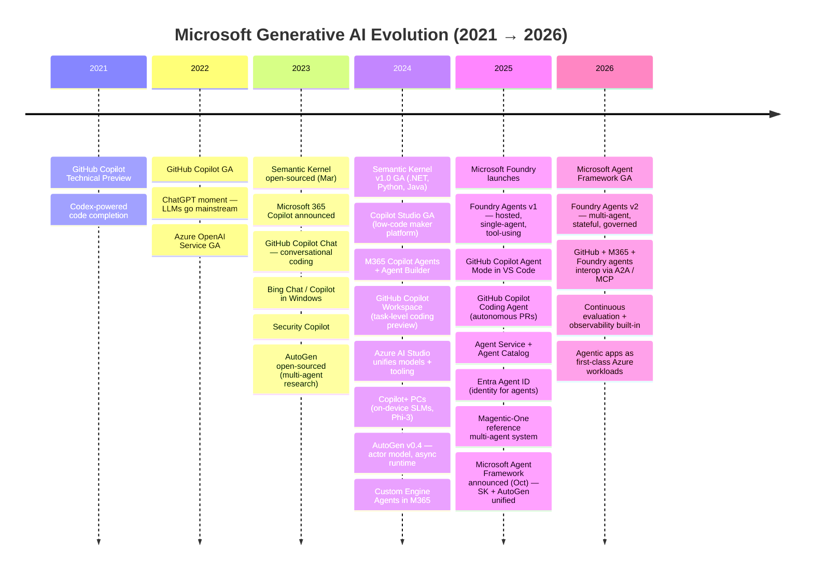
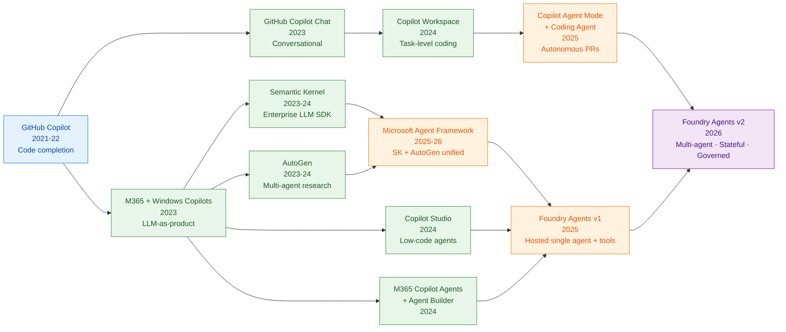
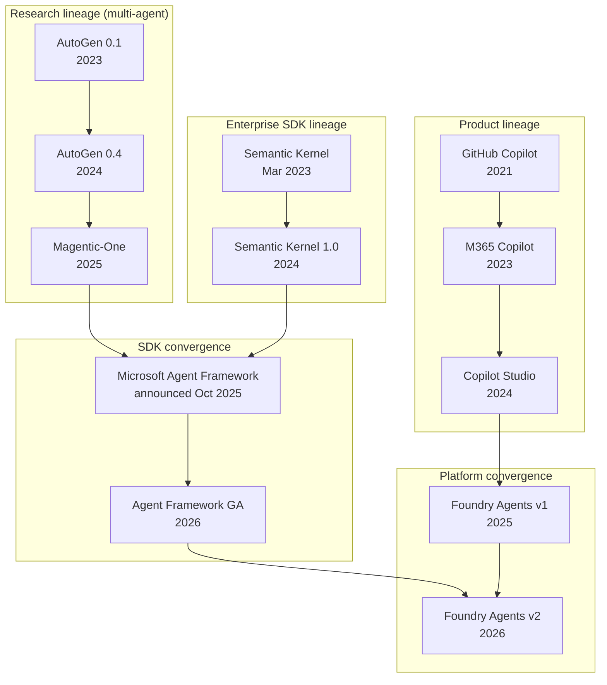

# The Evolution of Generative AI — A Microsoft Perspective

From the first GitHub Copilot preview to today's multi-agent Foundry runtimes, Microsoft's generative AI stack has evolved from **single-purpose code completion** to a **full agentic platform**. This document walks through that journey and visualizes it with Mermaid.

---

## TL;DR

- **2021 – 2022:** Copilot is born. Single-model, single-task code completion.
- **2023:** Copilot goes everywhere (M365, Windows, Security, Dynamics). **GitHub Copilot Chat** turns Copilot conversational. LLM-as-product era. **Semantic Kernel** open-sourced (Mar 2023) as Microsoft's enterprise SDK for LLM orchestration.
- **2023 – 2024:** **AutoGen** introduces multi-agent orchestration as an open-source research framework.
- **2024:** **Copilot Studio** democratizes agent building for makers; **Azure AI Studio** unifies model + tooling. **Microsoft 365 Copilot Agents** + **Agent Builder** ship. **GitHub Copilot Workspace** previews task-level coding. Semantic Kernel hits **v1.0 GA**.
- **2025:** **Microsoft Foundry** launches as the enterprise agent platform. **Agents v1** = single-agent, tool-using, hosted. **GitHub Copilot Agent Mode** + **Coding Agent** make Copilot truly agentic in the IDE and on GitHub.com. **Microsoft Agent Framework** announced (Oct 2025) — merging Semantic Kernel + AutoGen into one SDK.
- **2026:** **Foundry Agents v2** = multi-agent, stateful, governed, observable. Agent Framework GA powers the runtime. GitHub Copilot + M365 Copilot agents interop with Foundry agents via A2A / MCP. Agentic apps become first-class workloads.

---

## Timeline (Mermaid)

---

## Capability Progression (Mermaid)

---

## The Four Eras

### Era 1 — Completion (2021–2022)
**GitHub Copilot.** A single model (Codex) augmenting a single task (writing code). No tools, no memory, no orchestration. The value prop: *suggest the next token*.

### Era 2 — Copilots Everywhere (2023–2024)
LLMs became **products**: Microsoft 365 Copilot, Windows Copilot, Security Copilot, Dynamics Copilot. **GitHub Copilot Chat** turned the code assistant conversational; **Copilot Workspace** (2024 preview) raised the unit of work from line → task. **M365 Copilot Agents** + **Agent Builder** let users build no-code agents grounded in their tenant. The pattern is **RAG + grounding + system prompts**. In parallel two SDKs emerged:
- **Semantic Kernel** (Mar 2023, v1.0 GA 2024) — Microsoft's **enterprise-grade** LLM orchestration SDK for .NET, Python, and Java. Plugins, planners, memory.
- **AutoGen** (late 2023) — Microsoft Research's **multi-agent conversation** framework; v0.4 (2024) introduced an actor-model async runtime.

Meanwhile **Copilot Studio** put agent-building into the hands of business makers.

### Era 3 — Agents v1 + The Great Convergence (2025)
**Microsoft Foundry** consolidated the stack: models, tools, eval, deployment, identity. **Agents v1** = a hosted runtime where one agent can call tools, retrieve knowledge, and complete bounded tasks. Identity (Entra Agent ID), governance, and the Agent Catalog made agents deployable to enterprise.

On the developer surface, **GitHub Copilot Agent Mode** turned VS Code into an agent host — plan, edit, run, test, iterate — and the **GitHub Copilot Coding Agent** went further, picking up issues on GitHub.com and opening pull requests autonomously. Copilot stopped being autocomplete and started being a teammate.

In **October 2025**, Microsoft announced the **Microsoft Agent Framework** — explicitly merging **Semantic Kernel's enterprise SDK** with **AutoGen's multi-agent runtime** into a single open-source framework. One SDK for both the research patterns and the production-ready primitives, replacing the "which one do I use?" question developers had been asking for two years.

### Era 4 — Agents v2 (2026)
**Multi-agent by default.** Agents collaborate, hand off, and persist state across the **three Copilot surfaces** (GitHub, M365, Foundry-hosted). Continuous evaluation and observability are built in, not bolted on. **Microsoft Agent Framework GA** powers the Foundry Agents v2 runtime, and **A2A + MCP** let a GitHub Copilot coding agent call an M365 Copilot agent call a Foundry agent — closing the loop between the research lineage (AutoGen → Magentic-One), the enterprise SDK lineage (Semantic Kernel), and the product lineage (Copilot → Copilot Studio → M365 Agents).

---

## Two Lineages Converging (Mermaid)

---

## What Changed at Each Step

| Era | Unit of Work | Orchestration | State | Governance |
|-----|--------------|---------------|-------|------------|
| Copilot (2021–22) | Token suggestion | None | Stateless | App-level |
| Copilots (2023–24) | Grounded response | Single-shot RAG | Session | Tenant policies |
| GitHub Copilot Chat (2023) | Multi-turn coding answer | Inline + chat | Workspace context | Repo / org policies |
| M365 Copilot Agents (2024) | Tenant-grounded task | Declarative + actions | Conversation | Purview + admin |
| Copilot Workspace (2024) | Issue → plan → PR | Plan-edit-test loop | Workspace | Repo policies |
| Semantic Kernel (2023–24) | Function / plugin call | Planner + plugins | Memory store | Developer-owned |
| AutoGen (2023–24) | Agent turn | Conversational, code | In-memory | Developer-owned |
| Copilot Studio (2024) | Topic / action | Declarative flows | Conversation | Maker + admin |
| Foundry Agents v1 (2025) | Tool-using task | Single agent loop | Threads | Entra Agent ID, RBAC |
| GH Copilot Agent Mode (2025) | Autonomous coding session | Plan + tool calls in IDE | Workspace + git | Repo policies + review |
| GH Copilot Coding Agent (2025) | Issue → autonomous PR | Background runner on GitHub.com | Branch state | Branch protection + review |
| Agent Framework (2025–26) | Agent + workflow | SK plugins **+** AutoGen graphs | Durable threads | Enterprise-grade |
| Foundry Agents v2 (2026) | Multi-agent workflow | A2A / MCP / handoff | Durable + shared | Continuous eval + audit |

---

*Render the Mermaid blocks in any Mermaid-capable viewer (VS Code preview, GitHub, Loop, MkDocs, etc.).*
